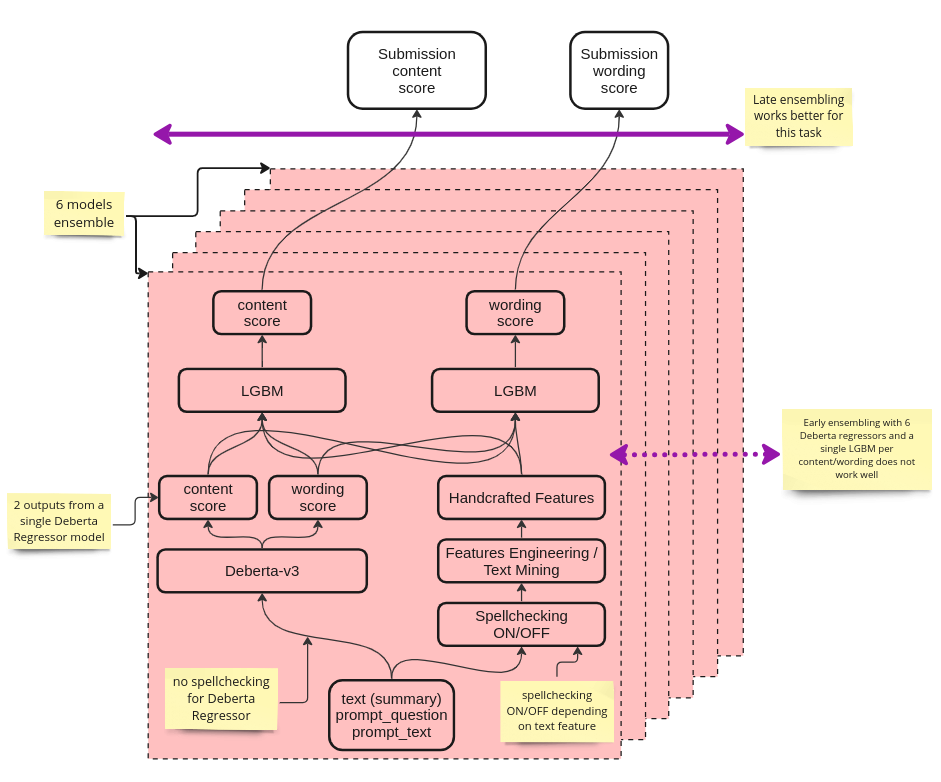

# CommonLit - Evaluate Student Summaries

## Introduction

This code is related to the Kaggle competition:  

**CommonLit - Evaluate Student Summaries**   
Automatically assess summaries written by students in grades 3-12  
https://www.kaggle.com/competitions/commonlit-evaluate-student-summaries

This was my first Kaggle competition and I ended in 42nd position out of over 2000 teams.

* Training code: [cless/run_sweep.py](https://github.com/Lukasz-Cesarski/cless/blob/main/cless/run_sweep.py)  
* Inference [code](https://www.kaggle.com/code/luki493/lgbm-ensemble-iter-e6-open)

## Solution

Final solution contains
* 6 [Deberta](https://huggingface.co/docs/transformers/model_doc/deberta) models (2 base and 4 large)
* LGBM on top of every model 
* Late Fusion ensemble

## Results

### Cross Validation:

|    | checkpoint_name                      | model_name   | adds   | pseudo |   content_rmse |   wording_rmse |   mcrmse |   lgbm_content_rmse |   lgbm_wording_rmse |   lgbm_mcrmse |
|---:|:-------------------------------------|:-------------|:-------|:-------|---------------:|---------------:|---------:|--------------------:|--------------------:|--------------:|
|  1 | lrg-add-nops-202310101531            | large        | True   | False  |       0.436815 |       0.563804 | 0.500309 |            0.416913 |            0.547992 |      0.482452 |
|  2 | lrg-add2-nops-202310071225           | large        | True   | False  |       0.422034 |       0.557535 | 0.489785 |            0.422094 |            0.552657 |      0.487376 |
|  3 | deberta-large-pseudo-20231004        | large        | False  | True   |       0.447833 |       0.599299 | 0.523566 |            0.431393 |            0.559015 |      0.495204 |
|  4 | cless-deberta-20230919-2131-ensamble | base         | False  | False  |       0.478477 |       0.6168   | 0.547638 |            0.436959 |            0.556711 |      0.496835 |
|  5 | base-noadd-pseu-202310101211         | base         | False  | True   |       0.450015 |       0.631051 | 0.540533 |            0.426784 |            0.570818 |      0.498801 |
|  6 | lrg-add2-ps-frz8-202310061415        | large        | True   | True   |       0.450208 |       0.574412 | 0.51231  |            0.439451 |            0.563622 |      0.501536 |

Columns:
* **checkpoint_name** - name of model checkpoint (4 folds inside) 
* **model_name** - which model was used: `microsoft/deberta-v3-base` or `microsoft/deberta-v3-large`
* **adds** - if `True` then `prompt_text` and `prompt_question` were both added to model as input
* **pseudo** - pretraining on [Feedback Prize - English Language Learning](https://www.kaggle.com/competitions/feedback-prize-english-language-learning/data) data
* **content_rmse**, **wording_rmse**, **mcrmse** - metrics of raw Deberta Regressor model 
* **lgbm_content_rmse**, **lgbm_wording_rmse**, **lgbm_mcrmse** - metrics of LGBM Regressor on top of every Deberta

**Note**: Models without `prompt_text` and `prompt_question` in input (adds=False) has much worse CV `mcrmse`. 
However this is mitigated by LGBM which utilizes `prompt_text` handcrafted text mining techniques and `lgbm_mcrmse` 
is significantly improved for these models

### Ensemble metrics

|   | metric                    | value |
|--:|:--------------------------|:------|
| 1 | content_rmse | 0.40780695722821314 | 
| 2 | wording_rmse | 0.5389858871892348 | 
| 3 | mcrmse | 0.47339642220872397 | 

### Leaderboard

|   | metric           | value |
|--:|:-----------------|:------|
| 1 | mcrmse (public)  | 0.432 | 
| 2 | mcrmse (private) | 0.468 |

Kudos for the author of [this notebook](https://www.kaggle.com/code/tsunotsuno/updated-debertav3-lgbm-with-spell-autocorrect) it helped me a lot.
